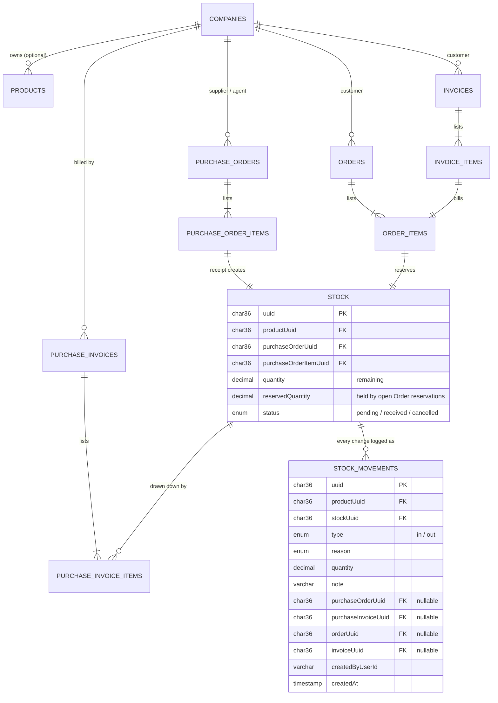
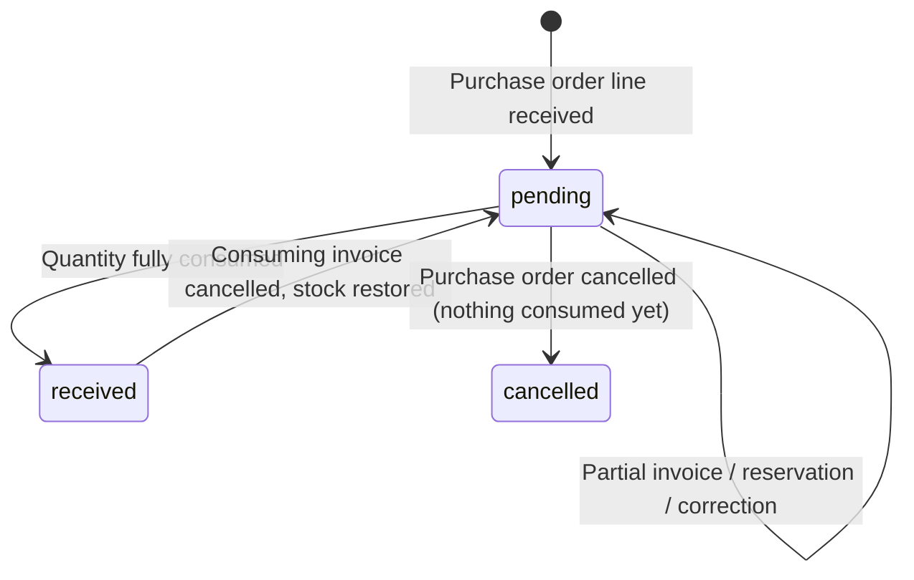

# Stock System — Flows Reference

Everything built on the `stock-movments` branch: purchasing-side receipt/consumption, sales-side
reservation/consumption, cancellations, corrections, edit flows, and the detail pages tying it all
together. This is a reference for what exists today, not a design proposal.

## Data model

Only one of `purchaseOrderUuid` / `purchaseInvoiceUuid` / `orderUuid` / `invoiceUuid` is ever set on
a given movement — whichever document caused it.

## Stock lifecycle

`reservedQuantity` is independent of `status` — it only ever moves via Order reserve/release/cancel,
and is never allowed to exceed `quantity`. **Available to sell or invoice is always
`quantity − reservedQuantity`.**

---

## Purchasing side

### Flow 1 — Purchase Order receives stock

Route: `/purchase-orders/new` · Action: `createPurchaseOrder`

1. Pick a **supplier** (required) and optionally an **agent**.
   - Guard: the chosen supplier/agent must already have at least one product on file
     (`Products.companyUuid` = that company), or the action rejects with an error before anything is
     created. This is enforced at the server action, not just hidden in the UI.
2. Pick one or more products from that company's catalog + a quantity each (at least one line
   required).
3. On submit (one transaction):
   - Insert `PurchaseOrders` (status `open`).
   - Insert one `PurchaseOrderItems` row per line.
   - Insert one `Stock` row per line — `status = "pending"`, `quantity` = ordered amount.
   - Insert one `StockMovements` row per line — `type: "in"`, `reason: "purchase_receipt"`.

### Flow 2 — Purchase Invoice consumes stock

Route: `/purchase-invoices/add` · Action: `createPurchaseInvoice`

1. Pick a supplier — their pending stock lots load into a picker (only lots with
   `quantity − reservedQuantity > 0`, so anything a sales Order has already reserved is excluded).
2. Pick one or more lots + a quantity each (optional overall — an invoice can still be created with
   no stock items, for purely financial/service invoices).
3. Server-side, per line: reject if the requested quantity exceeds `quantity − reservedQuantity` for
   that lot.
4. On submit (one transaction):
   - Insert `PurchaseInvoices`.
   - Insert `PurchaseInvoiceItems`.
   - Update `Stock`: `quantity -=`, flips to `status: "received"` if it hits zero. The update is
     guarded against the exact row read (`WHERE quantity = <value just read>`) — if another request
     changed it first, this one rolls back with "please refresh and try again" instead of
     overselling.
   - Insert `StockMovements` — `type: "out"`, `reason: "invoice_consumption"`.

### Flow 3 — Cancel a Purchase Order

Action: `cancelPurchaseOrder` · from `/purchase-orders/[uuid]`

- Blocked if **any** of its stock has already been invoiced (`status != "pending"`) or reserved by a
  sales Order (`reservedQuantity > 0`).
- Otherwise: `PurchaseOrders.status = "cancelled"`, each `Stock` row zeroed and set to
  `status: "cancelled"`, one `StockMovements` row per lot — `type: "out"`,
  `reason: "purchase_order_cancelled"`.

### Flow 4 — Cancel a Purchase Invoice

Action: `cancelPurchaseInvoice` · from `/purchase-invoices/[uuid]`

- Restores every lot the invoice drew from: `quantity +=`, `status` back to `"pending"`.
- `PurchaseInvoices.cancelled = true` (flagged, not deleted).
- One `StockMovements` row per restored lot — `type: "in"`, `reason: "invoice_cancelled"`.

### Flow 5 — Manual stock correction

Action: `createStockCorrection` · dialog on `/stock`

The only door into `Stock.quantity` that isn't caused by a document — for physical counts, damage,
or fixing a mistake.

1. Pick a **direction** (in/out), a **quantity**, a **reason**
   (`manual_correction` / `count_correction` / `damaged`), and an optional free-text **note**.
2. Guards: rejected on a `cancelled` lot; an "out" correction can't drop `quantity` below
   `reservedQuantity` (can't remove stock a sales Order is holding).
3. Update guarded the same way as invoice consumption (optimistic lock on the read quantity).
4. One `StockMovements` row — `type` = the chosen direction, `reason` = the chosen reason,
   `note` carried through.

---

## Sales side

This mirrors the purchasing side: an **Order** reserves stock (no physical change yet), an
**Invoice** bills the reservation (the actual consumption).

### Flow 6 — Order reserves stock

Route: `/orders/new` · Action: `createOrder`

1. Pick a customer (header fields, unchanged from before this branch).
2. Pick one or more products from **all** currently-available stock (not scoped to any one
   company — any customer can buy any lot that's actually in the warehouse) + a quantity each.
   Optional — an order can still be header-only.
3. Per line, guarded: requested quantity ≤ `quantity − reservedQuantity` for that lot.
4. On submit (one transaction):
   - Insert `Orders` (`status: "open"`).
   - Insert `OrderItems` per line — `status: "reserved"`.
   - `Stock.reservedQuantity +=` per line, guarded the same optimistic-lock way.
   - **No `StockMovements` row is written here** — a reservation is a hold, not a physical change.

### Flow 7 — Invoice bills the reservation

Route: `/invoices/add` · Action: `createInvoice`

1. Pick a customer — their open reservations (`OrderItems.status = "reserved"`) load as a checklist
   (product, quantity, which order), not a quantity-entry row: **a reservation is always billed in
   full**, never partially.
2. Check the reservations this invoice covers.
3. On submit, per checked reservation (still supports the pre-existing surcharges-only invoice with
   zero reservations):
   - `OrderItems.status → "invoiced"`, guarded against it already having moved (double-bill/cancel
     race).
   - `Stock.quantity -=`, `Stock.reservedQuantity -=` by the reservation's amount; flips to
     `status: "received"` if quantity hits zero.
   - Insert `InvoiceItems`.
   - Insert `StockMovements` — `type: "out"`, `reason: "sale_consumption"`.

### Flow 8 — Cancel an Order

Action: `cancelOrder` · from `/orders/[uuid]`

- Blocked if any of its items are already `invoiced`.
- Otherwise, every still-`reserved` item → `status: "cancelled"`, and `Stock.reservedQuantity -=`
  that item's amount. No `StockMovements` row (releasing a hold isn't a physical change either).

### Flow 9 — Cancel an Invoice

Action: `cancelInvoice` · from `/invoices/[uuid]`

- For each item billed by the invoice: `Stock.quantity +=`, `Stock.reservedQuantity +=` (the
  reservation is restored, not just the physical amount), linked `OrderItems.status` back to
  `"reserved"`.
- `Invoices.cancelled = true`.
- One `StockMovements` row per item — `type: "in"`, `reason: "sale_invoice_cancelled"`.

---

## Reason taxonomy (`StockMovements.reason`)

| Reason | Direction | Written by |
|---|---|---|
| `purchase_receipt` | in | Creating a purchase order |
| `invoice_consumption` | out | Creating a purchase invoice |
| `purchase_order_cancelled` | out | Cancelling a purchase order |
| `invoice_cancelled` | in | Cancelling a purchase invoice |
| `sale_consumption` | out | Creating a sales invoice (billing a reservation) |
| `sale_invoice_cancelled` | in | Cancelling a sales invoice |
| `manual_correction` | in / out | Stock correction dialog |
| `count_correction` | in / out | Stock correction dialog |
| `damaged` | in / out | Stock correction dialog |

Reserving or cancelling an **Order** never appears here — reservations aren't physical movements,
only the eventual invoice (or its cancellation) is.

---

## Editing (header-only)

Purchase orders, purchase invoices, orders, and invoices each have an edit page
(`/…/[uuid]/edit`) that only touches header fields (references, dates, remarks, payment terms).
Blocked once the record is cancelled. The counterparty (supplier/customer), line items, and
reservations are fixed at creation — editing those isn't supported, by design (resizing quantities
after Stock/StockMovements already exist would need careful partial-consumption handling that
wasn't in scope here).

## Detail pages

| Route | Shows |
|---|---|
| `/stock/[uuid]` | A single lot: status, original/remaining/reserved/available, its full movement history |
| `/stock-movements/[uuid]` | A single ledger entry: type, reason, quantity, note, source document link, the lot's current state |
| `/purchase-orders/[uuid]` | Header, line items with live stock status, Cancel / Edit |
| `/purchase-invoices/[uuid]` | Header, a Summary computed from this invoice's `StockMovements` (total taken / restored / net / movement count), items taken, Cancel / Edit |
| `/orders/[uuid]` | Header, reserved items with status (reserved/invoiced/cancelled), Cancel / Edit |
| `/invoices/[uuid]` | Header, which reservations were billed, Cancel / Edit |

None of these existed before this branch — the list pages already linked to them, but every one was
a 404 until now.

## List pages

- `/stock` — every lot, filterable by product/status/company, original-vs-remaining and
  reserved-vs-available columns, days-pending warning past 30 days, inline "Correct" action.
- `/stock-movements` — the full ledger, filterable by product/type/reason/date range.
- No pagination on either — removed deliberately, not an oversight.

## Products

Add Product (`/products/new`) has an optional **Supplier** field (`Products.companyUuid`), scoping a
product to a supplier's catalog the same way company-specific products already worked elsewhere.
Left empty, it's a general catalog product as before.

---

## Guarantees

- **One physical change, one ledger row.** Every `Stock.quantity` update is paired with exactly one
  `StockMovements` insert in the same transaction — the balance and the ledger can't drift apart.
- **Reservations are a hold, not a movement.** Only `reservedQuantity` changes when an Order
  reserves/releases; `StockMovements` only records when stock is physically received or consumed.
- **Concurrent writers can't oversell.** Invoice consumption, sale consumption, and corrections all
  guard their `UPDATE` against the exact row they read; a race rolls back with a clear error instead
  of silently double-spending a lot.
- **Every movement has an author.** `createdByUserId` (Clerk user id) is stamped on every row,
  system-triggered or manual — not yet resolved to a name in any UI.
- **Cancellation has a floor.** A purchase order can't be cancelled once any of its stock is
  invoiced or reserved; an order can't be cancelled once any of its lines is invoiced; a cancelled
  record can't be edited or corrected further.
- **Suppliers must have something to sell.** A company can only be picked as a purchase order's
  supplier or agent once it actually has products on file.

## Known gaps (not built, not silently missing)

- Stock is not location/lot/charge-aware — one row per purchase-order line, not per
  product × warehouse × batch.
- `cancelInvoice` doesn't have the same optimistic-lock guard against a double-cancel race that the
  other consuming actions have (low risk: admin-only, requires double-clicking cancel).
- `createdByUserId` is captured everywhere but never shown in any UI.
- Nothing in this branch has been exercised in a running browser — verification so far is
  typecheck + lint only.
